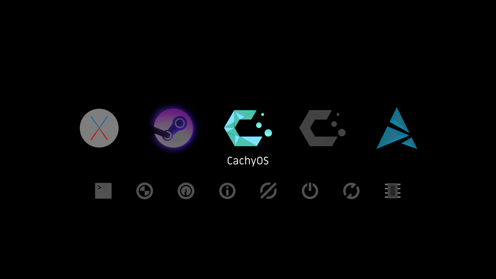
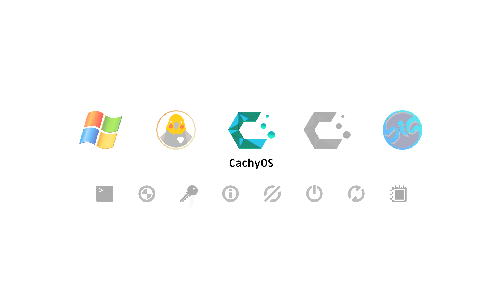
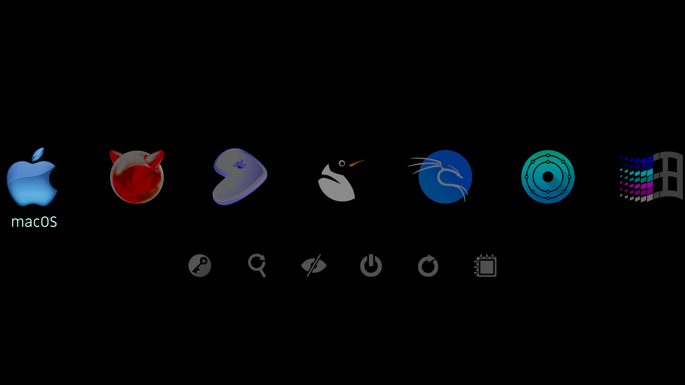

# rEFInd Tricky Transparencies Theme

This rEFInd boot manager theme uses transparency to vibrantly highlight and reveal a text label for only the selected icon.

rEFInd uses a background image to highlight the active icon typically with an outline, underline, halo, etc.  The icons of this theme are all custom edited so that they morph when a simple white background is put behind them.  Each icon contains a transparent text label, and it is easy to change the color of these labels or to hide them.

Swapping icons to or from this theme will not work without modification.  In part for that reason the selection of included icons is extensive (every rEFInd function & tool, over 200 distros, alternate retro icons for Mac & Windows).  Monochrome icons are also included for many distros to use with refind-btrfs snapshots.

### Icons Demo (50% Scale, shows 126 of the 299 large icons):

### Light Version: [refindTTL](https://github.com/gutlessCGH/refindTTL)

### Installation

Copy the theme folder to a `themes` directory inside the refind EFI directory (usually `/boot/EFI/refind`)

**Example**
>                                               
	sudo mkdir /boot/EFI/refind/themes                            (ignore command or error if directory exists)
	sudo cp -r ./refindTTT /boot/EFI/refind/themes/refindTTT	  (right click to open terminal in downloads folder)

Then add `include themes/refindTTT/theme.conf` at the end of '/boot/EFI/refind/refind.conf'
>

	sudo nano /boot/EFI/refind/refind.conf                    (ctrl+u to paste, ctrl+s to save, ctrl+x to exit)

### Customization

To use a smaller, 2/3 scale icon set change 'include themes/refindTTT/theme.conf' in '/boot/EFI/refind/refind.conf' to 'include themes/refindTTT/theme176.conf'

Alternate icons are included for macOS, Windows, and most rEFInd functions & tools.  Setting an alternate icon simply requires swapping icon names.

Open '/refindTTT/theme.conf' to edit:

* Maximum number of icons on screen
* Timeout before automatic boot
* Selection backgrounds (set alternates to hide text labels or to use color labels)
* Hidden elements (hints, labels, arrows, and badges are hidden by default but will work if enabled)

There are selection backgrounds for blue, purple, red, teal, or purple labels.  Text can be changed to any color by modifying the selection_big_...png & selection_small_...png files.  Paint over the bottom 50 pixels of the center square in big, the bottom 30 pixels in small.  Painting over the entire squares will also tint selected icon (not very effective for large icons, but will make small function icons all light up in color).  Either way keep the edges transparent.

### Setting Custom Icons

If the specific icon isn't automatically applied for a distro, refer to the [rEFInd documentation](https://www.rodsbooks.com/refind/configfile.html) for the seven different ways icons can be set for auto-detected boot loaders.

The icon can also be set with a fixed boot stanza in '/boot/EFI/refind/refind.conf'

**Example**
>

	menuentry " ****** " {                                      (replace ****** with OS name)
		icon /EFI/refind/themes/refindTTT/icons/******.png      (replace ****** with icon name)
	    loader /vmlinuz-linux-******                            (replace ****** to match file name in /boot )
	    initrd /initramfs-linux-******.img                      (replace ****** to match file name in /boot )
	    options "quiet ******"                                  (replace "quiet ******" with boot options)
	    }
    
Boot options may be found in refind_linux.conf ('sudo nano /boot/refind_linux.conf').   After booting into an OS copy the long string in quotes after 'Boot with standard options'

### Setting rEFInd-btrfs Custom Icon

Icons with the Btrfs logo and monochrome versions of distro logos are included for refind-btrfs snapshots.  To set one as a custom icon edit '/etc/refind-btrfs.conf'
>
	
	[boot-stanza-generation.icon]
	mode = "custom" 
	path = "themes/refindTTT/icons/btrfs.png"
